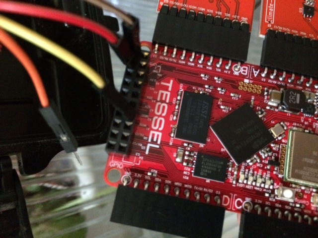
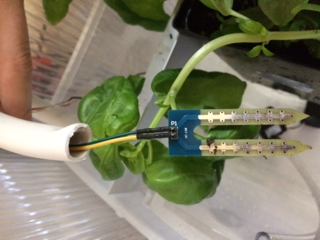
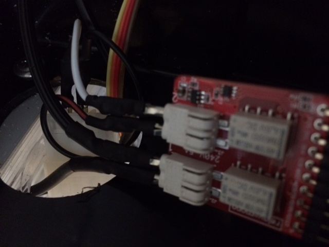
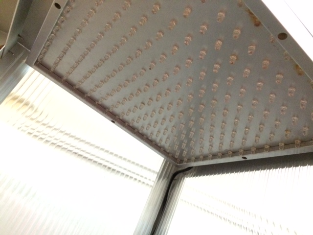
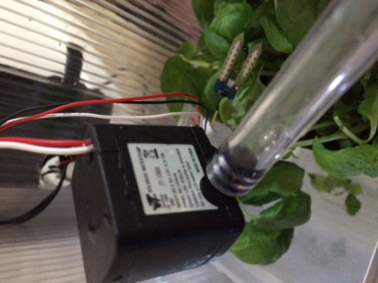
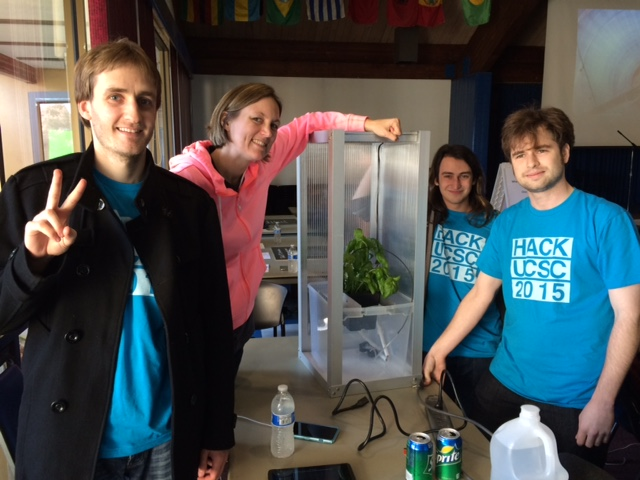

# Make it Rain!
Keep your plant alive from your cell phone!

## Software Instructions
1. To get started with Tessel, by following [their instructions](http://start.tessel.io/install)
1. Make sure you have `node.js` and all of the dependencies installed
2. For debugging, plug your machine into the tessel via USB (you need to have tessel
climate module plugged into slot B, and relay module plugged into slot D)
3. To run in debug mode, use `tessel run app.js`
3. To deploy to the tessel to have it run without your machine, use `tessel push app.js`

## Hardware Instructions
### Components needed:
1. tessel (a microcontroller that runs Javascript)
2. tessel climate module ('climate-si7020')
3. tessel relay module ('relay-mono')
4. moisture sensor
5. water pump
6. lights
7. chassis (optional)

### Connections:
Plug the tessel climate module into port A and the relay module  into port D.
For the moisture sensor, attach the power and ground to the pins in the tessel GPIO jumper
(in our 'tessel' image example we plug a red jumper cable into vcc, brown into ground, and yellow into pin A1).
In our setup, the tessel is supplied by a 5V power supply, and has USB battery power for backup. Tessle is powered by a mini-USB cable.



Information is gathered from the yellow pin using the below code in app.js:

```javascript
var gpio = tessel.port['GPIO'];     // select the GPIO port
var myPin = gpio.pin['A1'];
var moisture_data = myPin.read();
```



In our example, for the relays, one controls a 110V AC plug for the LED lamp, and the other relay controls a 12V DC plug for the pumps.



The relay is like a light switch that the tessel controls; when the tessel sends a signal to the relay, a mechanical switch flips
and the electricity is turned on/off for the corresponding component.
The relays can handle up to 240V / 5 amps, which is far more than needed.



The pump is a $7 pump from ebay, but any pump can be used.



Watch it in action:

[](https://www.youtube.com/watch?v=cq1TpndOx3Y)

To automate your plant care, you will need to build on this project.

## Team


Left to right (above):
[Sean Blum (Frontend)](https://github.com/SeanBlum),
[Brandy Dettmer (Backend)](https://users.soe.ucsc.edu/~brandy/),
[Zachary Rubin (Hardware)](http://zohii.com/),
[Blake Skinner (Hardware)](https://users.soe.ucsc.edu/~hskinner/)

Developed and presented over a weekend at a hackathon:

[](https://www.youtube.com/watch?v=6CPo0jXEvaM)

## Thank You
- [Laura Thompson](http://www.touchpond.com/) for being the best mentor our team could have had.